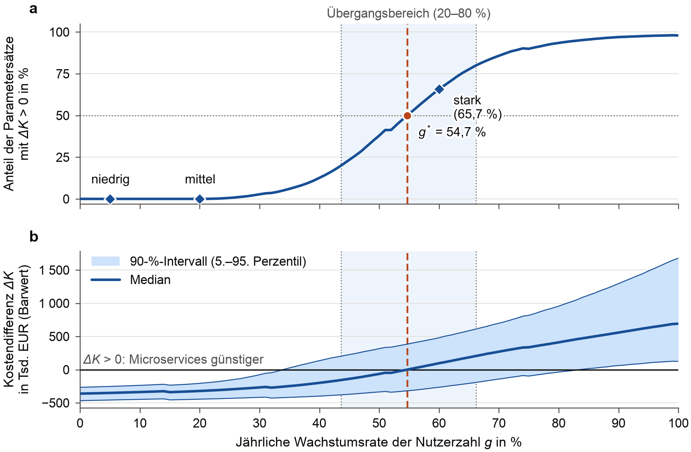
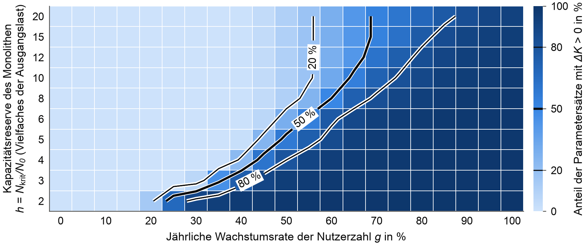

<div align="center">

# Microservices oder Monolith first?

**Stochastisches Kostenmodell zur Amortisation von Microservices-Architekturen unter Wachstumsunsicherheit**

[](https://doi.org/10.5281/zenodo.22983244)
[](https://github.com/jonasyr/microservices-amortization-model/actions/workflows/tests.yml)
[](https://www.python.org/)
[](LICENSE)
[](#exakte-replikation)

Begleitcode zur Projektarbeit<br>
*„Amortisation von Microservices-Architekturen unter Wachstumsunsicherheit:
Ein stochastisches Kostenmodell im Vergleich zu einem Monolith-first-Vorgehen“*

Jonas Weirauch [](https://orcid.org/0009-0009-6420-8576)<br>
IU Internationale Hochschule · B.Sc. Informatik · 2026

</div>

<br>

| | |
|---|---|
| **Kurs** | Praxisprojekt 6 (Kurscode DSPRAXP6042501) |
| **Prüfungsform** | Projektarbeit |
| **Forschungsfrage** | Unter welchen Wachstums- und Kostenbedingungen amortisiert sich die Mehrinvestition in eine Microservices-Architektur innerhalb von fünf Jahren? |
| **Methode** | Monte-Carlo-Simulation, 10 000 Parametersätze, Barwert in Monatsschritten, Horizont 5 Jahre |

## Inhalt

- [Worum es geht](#worum-es-geht)
- [Kernergebnisse](#kernergebnisse)
- [Exakte Replikation](#exakte-replikation)
- [Struktur](#struktur)
- [Zitieren](#zitieren)
- [English summary](#english-summary)

## Worum es geht

Lohnt es sich, eine neue Plattform von Beginn an als Microservices-Architektur zu bauen, oder ist
es günstiger, mit einem Monolithen zu starten und erst zu migrieren, wenn die Last es verlangt?
Das Modell vergleicht die barwertigen architekturbedingten Kosten beider Vorgehensweisen:

- **Microservices von Beginn (MS):** höhere Anfangsinvestition, Wartungs- und Plattformkosten,
  dafür Skalierung in Kapazitätsstufen.
- **Monolith first mit Migrationsoption (MF):** günstiger Start. Erreicht die Nutzerzahl die
  Kapazitätsgrenze des Monolithen, folgt eine Migration mit Parallelbetrieb.

Fünfzehn unsichere Kostenparameter werden aus Beta-PERT-Verteilungen gezogen. Die
Parameterbereiche und ihre Quellen stehen in [`src/params.py`](src/params.py).

## Kernergebnisse

Basisfall, 10 000 Parametersätze. Einordnung, Grenzen und alle Varianten stehen in der Arbeit.

| Kennzahl | Ergebnis |
|---|---|
| Szenariogewichtet (5 / 20 / 60 % Wachstum, p = 0,3 / 0,5 / 0,2): MF günstiger | in 99,93 % der Parametersätze |
| Starkes Wachstum (60 % p. a.): MS günstiger | 65,7 % (95-%-Intervall 64,8–66,6 %) |
| Break-even-Wachstumsrate *g\** (Amortisationswahrscheinlichkeit 50 %) | ≈ 55 % p. a. (Übergangsbereich 44–66 %) |
| *g\** über alle Modell- und Parametervarianten | ≈ 32–65 % p. a. |
| *g\** bei zehn Jahren Horizont | ≈ 24 % p. a. |
| Einflussreichste Größen (Varianzanteil) | Plattform-Grundlast, Kapazitätsreserve, Wartungsmehraufwand, Infrastrukturkosten |
| Amortisationsdauer bei 60 % Wachstum (Median, 90-%-Intervall) | 4,7 Jahre (3,3–6,2), innerhalb von 3 Jahren in 2,6 % der Parametersätze |
| Amortisationsdauer bei 100 % Wachstum (Median, 90-%-Intervall) | 3,3 Jahre (2,4–4,3), innerhalb von 3 Jahren in 29,2 % |
| Praxisangaben zum Vergleich (Plausibilisierung) | 2–3 Jahre (Taibi et al., 2017, S. 30), unter 5 Verkaufsjahren nach dreijähriger Neuentwicklung erwartet (Gouigoux & Tamzalit, 2017, S. 62, 65) |
| Stabilität gegenüber dem Startwert (5 Startwerte) | H1 99,82–99,93 %, H2 65,5–66,1 %, *g\** 54,6–54,7 % |

<p align="center">
  
</p>
<p align="center"><sub><b>Abb. 1</b> Amortisation in Abhängigkeit von der Wachstumsrate: (a) Anteil der Parametersätze mit Kostenvorteil für Microservices, (b) Median und 90-%-Intervall der Kostendifferenz ΔK = K<sub>MF</sub> − K<sub>MS</sub>.</sub></p>

<p align="center">
  
</p>
<p align="center"><sub><b>Abb. 2</b> Anteil der Parametersätze mit Kostenvorteil für Microservices nach Wachstumsrate und Kapazitätsreserve. Isolinien bei 20, 50 und 80 %.</sub></p>

## Exakte Replikation

Alle Zufallszahlen stammen aus einem festen Startwert (`SEED` in
[`src/params.py`](src/params.py)). Alle Pakete sind in [`requirements.txt`](requirements.txt)
gepinnt. Was die Replikation zusichert:

| | auf demselben Rechner | auf jedem anderen Rechner (Linux, Windows, macOS) |
|---|---|---|
| Tabellen und Zahlen der Arbeit | identisch | **identisch** |
| Ergebnisdaten eines frischen Laufs | zwei Läufe **byte-identisch** | gleiche Werte, einzelne Gleitkommazahlen weichen in der letzten Stelle ab (CPU und Rechenbibliotheken) |
| Veröffentlichte Daten in `output/data/` | byte-genau prüfbar mit `SHA256SUMS` | byte-genau prüfbar mit `SHA256SUMS` |

Die Prüfung `python -m src.verify` rechnet den vollständigen Lauf neu und bestätigt das auf jedem
Betriebssystem in drei Schritten: veröffentlichte Daten gegen `SHA256SUMS`, frische Daten gegen die
veröffentlichten (Toleranz 10⁻⁸, relativ ab Betrag 1, absolut darunter) und die daraus erzeugten
Tabellen und Zahlenmakros der Arbeit Zeichen für Zeichen.

Gemessen mit Version 1.1.2:

| Rechner | byte-identische Dateien | größte Abweichung | Tabellen und Zahlen |
|---|---|---|---|
| Windows 11, Python 3.14.3 | 4 von 10 | 4 · 10⁻¹⁵ | 8 von 8 identisch |
| GitHub Actions, Ubuntu, Python 3.14 | 3 bis 10 von 10 (je nach zugeteilter CPU) | 0 bis 9 · 10⁻¹¹ (Rundungsrest eines Werts, der mathematisch 0 ist) | 8 von 8 identisch |
| GitHub Actions, Windows, Python 3.14 | 4 von 10 | 4 · 10⁻¹⁵ | 8 von 8 identisch |

```bash
git clone https://github.com/jonasyr/microservices-amortization-model.git
cd microservices-amortization-model
python3.14 -m venv .venv && source .venv/bin/activate   # Windows: py -3.14 -m venv .venv; .venv\Scripts\activate
pip install -r requirements.txt

python -m src.verify      # vollständiger Lauf (ca. 6–8 min) und Vergleich, Ergebnis „OK: Replikation bestätigt.“
pytest                    # Grenzfall- und Regressionstests

sha256sum -c SHA256SUMS   # nur die veröffentlichten Daten prüfen (vor einem eigenen Lauf)
python -m src.run_all     # nur rechnen → output/data/ (überschreibt die veröffentlichten Daten)
python -m src.figures     # Abbildungen → output/figures/
python -m src.tables      # LaTeX-Tabellen und Zahlenmakros der Arbeit → output/tabellen/
```

Die veröffentlichten Daten stammen aus einem Lauf unter Linux x86_64 mit Python 3.14.7. Ohne eigene
Installation: Unter *Actions → Reproduktion → Run workflow* rechnet GitHub den vollständigen Lauf
unter Linux und Windows und prüft ihn mit `src.verify`.

## Struktur

| Pfad | Inhalt |
|---|---|
| [`src/params.py`](src/params.py) | Konstanten, Szenarien, unsichere Parameter mit Herkunft und Beleg |
| [`src/model.py`](src/model.py) | Kostenfunktionen und Barwerte beider Alternativen |
| [`src/sampling.py`](src/sampling.py) | Ziehung der Parametersätze (Beta-PERT, gleichverteilt) |
| [`src/experiments.py`](src/experiments.py) | Szenarien, Break-even, Heatmap, Sensitivität, Varianten, Amortisationsdauer, Startwert-Stabilität |
| [`src/analysis.py`](src/analysis.py) | PRCC, SRRC, Hilfsfunktionen |
| [`src/run_all.py`](src/run_all.py) | vollständiger Lauf, schreibt `output/data/` |
| [`src/figures.py`](src/figures.py), [`src/tables.py`](src/tables.py) | Abbildungen und LaTeX-Tabellen aus den Ergebnisdaten |
| [`src/verify.py`](src/verify.py) | Replikationsprüfung für jedes Betriebssystem |
| [`tests/`](tests/) | Grenzfall- und Regressionstests (`pytest`) |
| [`output/data/`](output/data/) | Ergebnisdaten des veröffentlichten Laufs (CSV/JSON) |
| [`SHA256SUMS`](SHA256SUMS) | Prüfsummen der Ergebnisdaten |
| [`CHANGELOG.md`](CHANGELOG.md) | Änderungen je Version |

## Zitieren

Weirauch, J. (2026). *Stochastisches Kostenmodell: Microservices von Beginn vs. Monolith first
mit Migrationsoption* [Software]. Zenodo. https://doi.org/10.5281/zenodo.22983244

Die DOI steht für alle Versionen und führt immer zur neuesten. Für eine bestimmte Version die
Versions-DOI von der [Zenodo-Seite](https://doi.org/10.5281/zenodo.22983244) verwenden.
Maschinenlesbare Angaben: [`CITATION.cff`](CITATION.cff). GitHub zeigt dazu rechts
„Cite this repository“ an.

## English summary

Stochastic total-cost model comparing *microservices from the start* with *monolith first with a
migration option* under uncertain user growth (Monte Carlo with 10,000 parameter sets, discounted,
monthly steps, five-year horizon). It computes break-even growth rates, a growth × capacity-reserve
map, local and global sensitivity (tornado, PRCC, SRRC²) and model variants. With a fixed seed and
pinned packages, repeated runs on the same machine are byte-identical. On any operating system,
`python -m src.verify` reruns the model and confirms that all tables and numbers quoted in the thesis
are identical and that the raw results match the published ones (individual floating-point values
may differ in the last digit across machines; verified on Windows and Ubuntu). Companion code to a project
thesis in the B.Sc. Computer Science programme at IU International University of Applied Sciences
(course “Praxisprojekt 6”, DSPRAXP6042501).

## Lizenz

[MIT](LICENSE) © 2026 Jonas Weirauch · Änderungen: [CHANGELOG.md](CHANGELOG.md)
